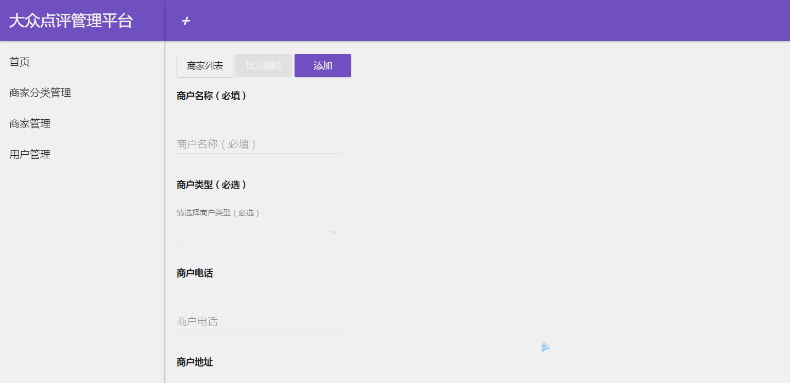

# admin

> A Vue.js project

## Build Setup

``` bash
# install dependencies
npm install

# serve with hot reload at localhost:9999
npm run dev

# build for production with minification
npm run build

# build for production and view the bundle analyzer report
npm run build --report
```

## 简介
#### 商户信息管理后台
* 使用vue2架构，vue-router控制路由，vuex管理状态，vue-axios处理http请求
## 技术栈
* vue2+vuex+vue-router+vue-axios+es6+muse-ui
#### 已经实现的功能
###### 商家分类管理
  * 录入
  * 编辑
  * 浏览
  * 删除
###### 商家管理
  * 录入
  * 编辑
     1. 点击商家可以查看该商家所有商品列表和该商家相册
     2. 相册可以选择上传，显示上传进度条
  * 浏览
  * 删除
     1. 可以单个删除或者批量删除
###### 商品管理
  * 添加
  * 编辑
  * 浏览
  * 删除

####  效果预览图


